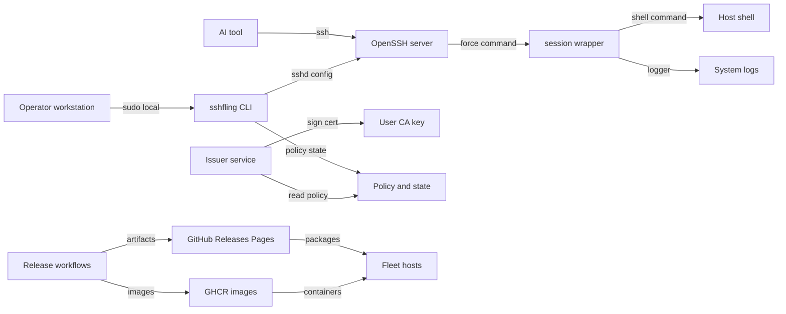

# SSHFling Threat Model

## Executive summary

SSHFling's highest enterprise risks cluster around privileged temporary SSH
access, package and repository publishing, GHCR container image publishing, CA
and repository signing key custody, incomplete expired-access cleanup
automation, desktop signing gaps, unsupported platform claims, and audit
breadcrumbs for AI-assisted work. The repo has meaningful controls: short-lived
grants, operational lifetime/session caps, explicit certificate mode, issuer
bearer-token validation, loopback defaults, systemd hardening, signed APT/RPM
repository support for the public package site, release evidence generation,
and best-effort `logger` audit events. Residual risk remains where host
accounts are privileged, a same-UID command can signal the shell monitor,
process containment depends on child-tree cleanup instead of a cgroup boundary,
release protections live in GitHub settings rather
than source, macOS signing/notarization depends on externally configured
credentials and evidence, Windows Authenticode and container signing/provenance
are external, security scans are not required CI gates, and breadcrumb retention
depends on operator workflow.

## Scope and assumptions

In scope:

- Runtime access broker and CLI: `bin/sshfling`, `production/sshfling-session`, `systemd/sshflingd.service`, `systemd/sshflingd.env.example`.
- SSH host configuration paths: password grants, certificate host install/uninstall, password prune, OpenSSH wrapper behavior.
- Agentic workflow documentation: `docs/ai-temporary-access.md`, `docs/codex-enterprise-workflow.md`.
- Package and container publishing validation: `.github/workflows/release-packages.yml`, `.github/workflows/public-package-web.yml`, `.github/workflows/github-packages.yml`, `packaging/build-public-web.sh`, `packaging/verify-public-web.sh`, `packaging/version.sh`, `docs/release-checklist.md`, `docs/release-evidence.md`, `docs/repos.md`.
- Docker harness defaults only as a development/test boundary, not as the production host model.

Out of scope:

- Real GitHub organization settings, branch/tag protection rules, environment approval configuration, and secret-store access lists.
- Customer host hardening outside files written by SSHFling.
- External macOS notarization and Windows Authenticode signing systems unless their evidence is attached to a release packet.

Assumptions:

- Production usage is a CLI and OpenSSH workflow run by an authorized operator, usually with `sudo`, on a host where temporary SSH access is intentionally granted.
- Enterprise Linux fleets install from signed APT/RPM repository metadata; convenience installer scripts are not the production trust anchor.
- The issuer service is loopback-only by default and is placed behind approved TLS, mTLS, VPN, or reverse-proxy controls before any remote exposure.
- AI tools connect over standard SSH from an operator workstation or approved automation environment; the target host is not expected to run a vendor AI daemon.

Open questions that would change risk:

- Are release tags, the `github-pages` environment, and repository signing secrets protected by mandatory review in GitHub settings?
- Are GHCR package publish permissions, image tags, and container consumers protected by signature, digest pinning, and mandatory release review?
- Are CA private keys and repository signing keys stored in GitHub secrets only, or in a managed KMS/HSM/signing service?
- Do production hosts enable the packaged `sshfling-prune.timer`, or an equivalent fleet job, and alert on failed prune runs or expired grant metadata?
- Are AI/tool accounts denied `sudo`, scheduler access, service-unit writes, and other persistence paths by host policy?

## System model

### Primary components

- `sshfling` CLI (`bin/sshfling`): creates password grants, issues certificates, installs host certificate trust, starts issuer/web services, tracks/kills sessions, prunes expired grants, and manages detached jobs.
- OpenSSH server: accepts temporary password grants or user certificates and invokes a forced command wrapper for SSHFling-managed access.
- Session wrapper (`production/sshfling-session`): applies wall-clock lifetime, max-session locks, expiration checks, child-process cleanup, environment markers, and best-effort system audit events. It is not a privilege boundary against the command running as the same UID.
- Issuer service (`bin/sshfling::cmd_serve`, `IssuerHandler`): local HTTP API for certificate issuance using a bearer token, allowed principals, request body caps, and per-IP rate limiting.
- Web console (`bin/sshfling::cmd_web`, `WebHandler`): localhost-by-default admin UI for policy updates and session kills, protected by password/session/CSRF controls.
- Policy and state: `/etc/sshfling/policy.json`, `/var/lib/sshfling/password-grants`, per-user detached metadata under `~/.sshfling/detached`.
- Package publishing: GitHub Actions workflows build packages, generate checksums/evidence, optionally sign APT/RPM metadata, attest provenance, deploy a verified Pages artifact, and publish client/server container images to GHCR.
- Agentic workflow breadcrumbs: named grants, detached job names, PIDs, stdout/stderr logs, worker-owned path prompts, release tickets, and workflow links.

### Data flows and trust boundaries

- Operator workstation -> target host CLI: data includes requested username, lifetime, public key, policy values, and optional remote command context; channel is local shell over an already-authorized admin session; security guarantees are OS user permissions and `sudo`; validation includes username regex, lifetime caps, policy normalization, and certificate option gating in `bin/sshfling`.
- SSH client or AI tool -> OpenSSH server: data includes password, certificate, SSH commands, and terminal input/output; channel is SSH; security guarantees are OpenSSH authentication, password/certificate validity, disabled forwarding in managed snippets, and the forced wrapper; validation is OpenSSH plus wrapper arguments and policy caps.
- `sshd` -> `sshfling-session`: data includes `SSH_ORIGINAL_COMMAND`, grant username, login user, max seconds, expiry, and policy path; channel is local process execution through `ForceCommand`; controls include expiration rejection, root-provisioned max-session locks, wrapper-owned timeout monitoring, and system logger events. New SSHFling-created accounts use a root-owned POSIX login-shell dispatcher bound to the installed wrapper, policy, and trusted Bash; it accepts only the generated certificate/password argument forms and starts Bash in privileged mode. Validated installs scan included OpenSSH configuration and reject user-controlled loader/startup variables or exported functions, including conditional `Match` rules. Existing account shells and installs performed with `--no-validate` remain administrator responsibilities.
- Issuer client -> issuer service: data includes bearer token, principal, public key, requested lifetime, key id, source-address option, and PTY option; channel is HTTP on loopback by default; controls include token placeholder/length checks, constant-time comparison, body size cap, allowed principal list, POST rate limit, and refusal of non-loopback bind without explicit remote mode.
- Issuer service -> CA private key: data includes public key, serial, principal, lifetime, and certificate critical options; channel is local filesystem plus `ssh-keygen`; security guarantees are file permissions, systemd read-only `/etc/sshfling`, and service group read access; validation includes policy caps and allowed principal checks.
- CLI/web -> policy and grant state: data includes JSON policy, grant metadata, managed sshd snippets, and detached job metadata; channel is local filesystem; controls include root requirements for sensitive commands, atomic JSON writes, file mode setting, marker checks before removal, and policy max caps.
- Release workflow -> GitHub Releases/Pages -> fleet package managers: data includes source archives, packages, metadata, checksums, signing keys, provenance attestations, and install scripts; channel is GitHub Actions artifact flow and HTTPS package downloads; controls include version validation, exact artifact set checks, SHA-256 generation, APT/RPM signing support for the package-site path, verifier rejection of weak trust flags, tag-only package-site publish gate, a named Pages environment, and release evidence packets. Required reviewer settings, protected tags, and live approvals are external GitHub controls.
- GitHub Packages workflow -> GHCR -> container consumers: data includes Docker build contexts, OCI image layers, latest/version/SHA tags, labels, and registry package metadata; channel is GitHub Actions to GHCR and container pulls; source controls include version/tag consistency checks, limited workflow permissions, source/security/container gates, SBOM/provenance emission, cosign digest signing, and the `github-packages` environment. GitHub-side environment reviewers, protected tags, vulnerability triage/threshold evidence, and consumer digest/signature enforcement remain external controls.
- AI worker -> repository/task artifacts: data includes prompts, owned paths, detached logs, PIDs, and workflow validation links; channel is SSH shell, local filesystem, GitHub tickets/actions; controls are documentation and conventions rather than hard runtime enforcement.

#### Diagram

## Assets and security objectives

| Asset | Why it matters | Security objective C/I/A |
| --- | --- | --- |
| Temporary passwords and generated client keys | Grant direct SSH access during the allowed window. | C/I |
| OpenSSH user certificates | Bypass password flow and authenticate as configured principals. | C/I |
| SSHFling user CA private key | Can mint trusted SSH certificates if stolen or misused. | C/I |
| Repository signing private key and fingerprint | Establishes APT/RPM package trust for fleets. | C/I |
| GitHub release workflows, tags, Pages deployment, and package artifacts | Compromise can distribute root/admin code to customers. | I/A |
| GHCR container images, tags, and digests | Compromise can distribute altered client/server runtime images to container users. | I/A |
| Platform coverage records and support claims | Unsupported OS, runtime, CPU architecture, hardware, ARM/IoT, or FPGA/SoC claims can push customers into unvalidated deployments. | I/A |
| `/etc/sshfling/policy.json` | Controls lifetime and concurrency caps. | I/A |
| Password grant metadata and managed sshd snippets | Determines whether expired password grants are blocked, locked, or deleted. | I/A |
| `sshfling-session` wrapper | Enforces timeout and max-session behavior for active sessions. | I/A |
| Host Unix accounts and privileges | Temporary access inherits account privileges and persistence options. | C/I/A |
| Audit logs, detached metadata, stdout/stderr logs, release evidence | Needed for incident response, attribution, rollback, and enterprise evidence. | I/A |
| AI prompts, task names, and worker-owned path records | Provide breadcrumbs for agentic work and prevent unreviewable concurrent edits. | I/A |

## Attacker model

### Capabilities

- Remote network attacker can attempt SSH authentication against exposed hosts and issuer/web endpoints if operators expose them.
- Token holder can call the issuer API if they obtain the bearer token and network path.
- Malicious or compromised package publisher can attempt to modify artifacts, metadata, install scripts, or signing keys.
- Malicious or compromised package publisher can attempt to publish mutable GHCR image tags or altered OCI layers.
- Temporary SSH user or AI tool can run commands with the granted Unix account's privileges during the grant window.
- Insider or compromised maintainer account can attempt to alter release workflows, policy files, tags, or release evidence.

### Non-capabilities

- A remote attacker does not get `sudo` on the target host unless they already control an admin/operator credential.
- The Docker test harness is not assumed to protect production hosts.
- SSHFling does not claim to sandbox a granted Unix account from that account's normal filesystem, network, `sudo`, scheduler, or service-management permissions.
- The repo cannot prove GitHub organization protections or external signing/notarization controls without attached evidence.

## Entry points and attack surfaces

| Surface | How reached | Trust boundary | Notes | Evidence repo path or symbol |
| --- | --- | --- | --- | --- |
| Password grant setup | `sudo sshfling -t ...` | Operator/admin -> root local host | Creates Unix user/password, managed `Match User`, metadata, wrapper. Password is the default access type, but setup requires an explicit lifetime. | `bin/sshfling::cmd_setup_password`, `password_grant_config` |
| Password SSH login | `sshfling user@host` or `ssh user@host` | Workstation/AI -> OpenSSH | Password auth enabled only for managed user; forwarding disabled; forced wrapper applies. | `bin/sshfling::password_grant_config`, `production/sshfling-session` |
| Certificate issue CLI | `sudo sshfling --certificate -t ...`, `sudo sshfling cert issue --certificate -t ...` | Operator/admin -> CA key | Signs public keys with force-command critical option and policy cap after a CA keypair exists. Certificate setup rejects dry-run, missing CA keypairs, and implicit lifetimes. | `bin/sshfling::cmd_setup_certificate`, `sign_user_certificate` |
| Certificate host install/uninstall | `sshfling host install/uninstall` | Root local host -> OpenSSH config | Installs trusted CA, principals, wrapper, and managed sshd config; uninstall removes managed files by marker/content. | `bin/sshfling::cmd_host_install`, `cmd_host_uninstall` |
| Issuer API | `POST /v1/certificates` | Issuer client -> local HTTP service | Bearer token, body cap, rate limit, allowed principals, loopback default. | `bin/sshfling::IssuerHandler`, `cmd_serve`, `systemd/sshflingd.env.example` |
| Web console | `sshfling web` | Browser/admin -> local HTTP service | Password auth, CSRF token, session cookie, policy updates, session kills. | `bin/sshfling::WebHandler`, `cmd_web` |
| Active session list/kill | `sshfling list`, `sshfling -k`, `sshfling shutdown` | Root operator -> process table | Finds wrapper and child PIDs; kills process tree. | `bin/sshfling::find_sshfling_sessions`, `kill_sshfling_sessions` |
| Expired grant prune | `sshfling password prune --all`, `sshfling password prune --username USER`, `sshfling cert prune --all` | Root operator/timer -> local state | Requires exactly one selector, removes expired managed password snippets and metadata, locks or deletes users depending on ownership and flag, and removes expired SSHFling-generated certificate material. | `bin/sshfling::prune_password_grants`, `cmd_password_prune`, `prune_certificate_sessions`, `cmd_cert_prune`, `systemd/sshfling-prune.timer` |
| Detached jobs | `sshfling detached start/list/kill` | Operator/session -> local process manager | Metadata/logs in user-owned dir; max 10 jobs; forced-session starts denied unless explicitly allowed. | `bin/sshfling::cmd_detached_start`, `cmd_detached_supervisor` |
| Package release | Tag push or workflow dispatch | Maintainer/GitHub -> artifacts/releases | Builds packages, verifies versions/artifact set, checksums, evidence, attestations. | `.github/workflows/release-packages.yml`, `packaging/version.sh` |
| Public package site | Tag publish to Pages | GitHub Actions -> package managers | Generates APT/RPM/Homebrew/macOS/Windows/community outputs, signing metadata, verifier gates. | `.github/workflows/public-package-web.yml`, `packaging/build-public-web.sh`, `packaging/verify-public-web.sh` |
| GHCR container images | Tag push or workflow dispatch | GitHub Actions -> container registry/users | Runs source tests, release security evidence, and container/package lifecycle tests before publishing client/server images with version/tag/SHA tags; publishes Docker provenance and SBOM attestations; signs pushed image digests with keyless Sigstore; uses the `github-packages` environment. | `.github/workflows/github-packages.yml`, `ssh-client/Dockerfile`, `ssh-server/Dockerfile` |
| Agentic workflow breadcrumbs | AI-assisted SSH or detached work | Operator/AI -> repo, logs, tickets | Named grants/jobs, PIDs, logs, workflow links, worker-owned paths are documented but mostly procedural. | `docs/ai-temporary-access.md`, `docs/codex-enterprise-workflow.md`, `.codex/config.toml` |

## Top abuse paths

1. Package supply-chain compromise -> attacker alters package metadata or install script -> fleet installs attacker-controlled `sshfling` as root/admin -> attacker steals CA keys, policy, or host credentials.
2. Repository signing key theft -> attacker publishes signed malicious APT/RPM metadata -> package manager accepts update -> enterprise hosts run malicious package code.
3. GHCR container supply-chain compromise -> attacker pushes a malicious `latest`, branch, or version tag -> a user pulls the altered image without digest or signature verification -> attacker controls the SSHFling client/server runtime container.
4. Issuer token theft plus remote exposure -> attacker calls `/v1/certificates` for an allowed principal -> receives a trusted user certificate -> SSHs into target until certificate/wrapper expiry.
5. CA private key theft -> attacker signs certificates outside SSHFling -> omits force-command or extends validity -> host accepts access if the trusted CA remains installed.
6. Temporary grant to privileged account -> AI tool or attacker runs commands as `root`/deploy -> modifies services, credentials, scheduled jobs, or data within the grant window -> temporary identity gives attribution but not isolation.
7. Process escape from timeout wrapper -> temporary user starts re-parented or scheduler-managed process -> wrapper kills known child tree but not all host persistence paths -> work continues after access expiry.
8. Expired password grant is not pruned -> managed sshd snippet and account remain until manual cleanup -> wrapper rejects expired logins, but stale state increases operational confusion and account-management risk.
9. Breadcrumb gap in parallel AI work -> agent grants/jobs are unnamed or logs are lost -> reviewers cannot tie changes to tickets, PIDs, workflow runs, or owners -> malicious or mistaken changes are harder to audit and roll back.
10. Unsupported platform claim -> customer deploys to an unvalidated OS, CPU architecture, edge appliance, or FPGA/SoC control plane -> required Python/OpenSSH/account tooling differs from assumptions -> temporary access, cleanup, logging, or package trust behavior fails in production.

## Threat model table

| Threat ID | Threat source | Prerequisites | Threat action | Impact | Impacted assets | Existing controls evidence | Gaps | Recommended mitigations | Detection ideas | Likelihood | Impact severity | Priority |
| --- | --- | --- | --- | --- | --- | --- | --- | --- | --- | --- | --- | --- |
| TM-001 | Compromised maintainer, workflow, or package site | Ability to alter release workflow, package artifact, Pages output, or release asset before install. | Publish malicious package or install guidance that fleet hosts trust. | Root/admin code execution on installing hosts and possible theft of local policy/CA material. | Packages, release workflows, host accounts, CA keys. | Version validation in `packaging/version.sh`; exact artifact and checksum validation in `.github/workflows/release-packages.yml`; verifier rejects weak trust flags in `packaging/verify-public-web.sh`; package-site deploy only proceeds from a tag with stable signing secrets in `.github/workflows/public-package-web.yml`; macOS package signing/notarization can be required through `packaging/build-pkg.sh` and workflow-provided signing variables; Windows MSI signing/verification can be required through `packaging/build-msi.ps1` and workflow-provided Authenticode variables. | Real tag/branch/environment protections and approver records are external settings; the `github-pages`, `release-signing`, `release-packages`, and `github-packages` environment names do not prove required reviewers; macOS and Windows signing still depend on external credentials and retained evidence; standalone release assets rely on checksums/provenance unless separately signed. | Require protected tags/environments, two-person review for release secrets, signed commits/tags where policy requires, completed `docs/release-evidence.md`, and post-publish install validation before customer rollout. | Alert on release/tag creation, Pages deploy, secret changes, package-site verifier failures, checksum drift, and unexpected workflow actor. | Medium | High | high |
| TM-002 | Signing key thief or overprivileged workflow | Access to `SSHFLING_REPO_GPG_PRIVATE_KEY`, passphrase, or CA private key. | Sign malicious repo metadata or mint SSH certificates outside approved flow. | Fleet package trust or temporary-access model is defeated. | Repo signing key, CA private key, certificates, packages. | Fingerprint checks in `packaging/build-public-web.sh`; production publish requires signing key/fingerprint in `.github/workflows/public-package-web.yml`; CA files documented root-owned/group-readable in `README.md` and read-only service paths in `systemd/sshflingd.service`; `ca init --force` keeps the old keypair until a complete replacement pair is generated. | No repo-native proof of KMS/HSM custody, key rotation, or access review; CA key is still generated as an unencrypted root-owned file unless operators use an external custody pattern. | Store production signing keys in managed signing service or protected environment secrets with review; separate CAs per environment/account class; rotate on maintainer departure; consider HSM/constrained helper for CA signing. | Audit secret access changes, signing fingerprint changes, unexpected cert serials, CA file reads, and package metadata signed by unknown fingerprint. | Medium | High | high |
| TM-003 | Remote attacker or stolen issuer token holder | Issuer bound remotely or reverse proxy exposed; token leaked or weak. | Call issuer API to mint a short-lived certificate for an allowed principal. | Unauthorized SSH access until cert/wrapper expiry; potential host compromise if account is privileged. | Issuer token, CA key, allowed principals, host accounts. | Loopback default and remote-bind refusal in `cmd_serve`; token placeholder/length validation and constant-time compare in `validate_bearer_token`/`bearer_token_matches`; body cap and rate limit in `IssuerHandler`; systemd hardening in `systemd/sshflingd.service`. | TLS/mTLS/VPN controls are operator-managed; token storage and rotation are not enforced by code; rate limit is in-memory per process. | Keep issuer loopback unless behind approved mTLS/VPN; rotate bearer tokens; set source-address certificate options where feasible; log issuer client identity at proxy; deny remote mode in baseline fleet policy. | Alert on `issuer_service_started allow_remote=true`, issuer 401/429 spikes, certificates outside ticket windows, and unusual source addresses. | Medium | High | high |
| TM-004 | Temporary SSH user, compromised AI tool | A grant targets a privileged Unix account or account with persistence permissions. | Use normal account privileges to modify files, services, sudo paths, credentials, or data. | Temporary access becomes full host compromise during the allowed window. | Host accounts, data, service configs, credentials. | Policy caps in `default_policy`/`validate_policy_values`; password grants refuse existing users by default and refuse root-equivalent Unix users in `cmd_setup_password`; host config disables forwarding in `cmd_host_install`; wrapper logs session events. | No sandbox beyond Unix account permissions; root-equivalent certificate grants are possible through explicit login user/certificate setup; host sudo/scheduler policy is external. | Use dedicated least-privilege temp accounts; block root/deploy break-glass grants by policy unless explicitly approved; remove `sudo`, `cron`, `at`, `systemd-run`, and writable service paths for AI/tool accounts; use systemd scopes for high-risk work. | Monitor temp-account sudo attempts, service file changes, scheduled jobs, sensitive file reads, and named grant activity outside ticket windows. | Medium | High | high |
| TM-005 | Temporary SSH user trying to outlive grant | Ability to run shell commands in an SSHFling-managed session. | Signal or stop the same-UID wrapper monitor, re-parent processes, use schedulers, or start detached/systemd/tmux work to continue after wrapper exits. | Work persists after temporary access expiry; may maintain access or modify host later. | Session wrapper, host processes, detached logs, accounts. | Wrapper timeout and child-tree kill in `production/sshfling-session`; root-provisioned connection-slot files; root-owned login-shell dispatcher bound to the generated wrapper/policy command; effective `sshd` user-environment validation; forced-session environment markers; `cmd_detached_start` denies forced-session starts unless allowed and caps to remaining time; max detached jobs. | The wrapper and command share a UID, so a hostile command can signal or stop the monitor; no cgroup/systemd scope enforcement exists for every SSH session; scheduler and service-manager permissions are host policy; process-tree cleanup can miss re-parented work; existing-account shells and `--no-validate` staged installs require operator review. | Run forced sessions under a privileged supervisor or systemd scope with `RuntimeMaxSec` and `KillMode=control-group`; deny scheduler/service-manager tools to temp users; audit existing-account shell startup behavior; add regression tests for `setsid`, `nohup`, `disown`, `cron`, `at`, and `systemd-run`. | Alert on processes owned by temp users after grant expiry, detached job timeout failures, and scheduler entries created by temp accounts. | Medium | High | high |
| TM-006 | Operator omission, stale host state | Password grant expires but no prune automation runs or the packaged timer is disabled/failing. | Leave managed sshd snippet, stale account, expired generated cert material, or metadata behind. | Operational confusion, stale account surface, failed compliance evidence for access deletion. | Password grant metadata, Unix accounts, sshd config, generated certificate session material. | Wrapper rejects expired logins via `--expires-at`; setup runs pre-prune for same username; `prune_password_grants` removes expired managed config/metadata and locks or deletes users; `prune_certificate_sessions` removes expired SSHFling-generated key/cert material; DEB/RPM packages ship and enable `sshfling-prune.timer` on systemd hosts; docs describe prune semantics; deletion guards refuse root-equivalent users even if metadata is forged. | Timer enablement and alerting still need release/fleet evidence; deletion only occurs with `--delete-users` and only for SSHFling-created non-root-equivalent users after config removal is verified. | Verify `sshfling-prune.timer` or equivalent fleet job in release evidence; alert on expired metadata and failed prune units; produce cleanup evidence in runbooks. | Monitor `/var/lib/sshfling/password-grants` and `/var/lib/sshfling/sessions` for expired JSON files, locked/deleted user results, and sshd snippets older than policy. | Low | Medium | medium |
| TM-007 | Malicious or mistaken AI agent | Concurrent agent work lacks stable identifiers, owned paths, or retained logs. | Change files without clear task owner; erase detached logs with `--replace`; omit release/workflow links. | Weakened auditability and harder rollback or incident reconstruction. | Prompts, detached metadata/logs, release tickets, audit logs. | Named grants/jobs in docs; detached metadata/log paths in `cmd_detached_start`; `.codex/config.toml` sets `max_depth=1`; `docs/codex-enterprise-workflow.md` requires disjoint write sets and workflow links. | Ticket IDs are not enforced by CLI; `logger` is best effort; detached logs are user-local and can be deleted on replace; central retention is external. | Require ticket-formatted grant/job names; ship a `--reason` or structured audit field; centralize syslog/journald and detached logs; prohibit `--replace` without ticket reference; attach workflow links to release/change records. | Alert on unnamed grants, detached jobs without ticket pattern, missing logs, concurrent writes to same path, and workflow validation absent from release ticket. | Medium | Medium | medium |
| TM-008 | Web console attacker or weak admin password | Web console exposed remotely or password/session secret mishandled. | Log in, change policy caps, or kill sessions. | Reduced access controls, denial of service against active work, audit noise. | Policy file, active sessions, web session cookie. | `cmd_web` requires root, loopback default, remote bind refusal without `--allow-remote`, PBKDF2 password hash support, CSRF token, `SameSite=Strict`, rate-limited login. | TLS, external auth, password rotation, and central logging are operator-managed; session secret is process-local unless env configured. | Keep web loopback behind SSO/mTLS if exposed; require hashed passwords; set stable high-entropy session secret; alert on remote mode. | Alert on `web_service_started allow_remote=true`, login failures, policy updates, and session kills. | Low | Medium | medium |
| TM-009 | Sales, release, or deployment process overclaims coverage | Platform claim is copied from artifact generation or workflow names without host evidence. | Deploy SSHFling to unvalidated OS/hardware or embedded/FPGA control-plane environments. | Temporary access, package install, cleanup, logging, or dependency behavior may fail where enterprise policy assumed support. | Platform coverage records, release evidence, customer hosts, audit records. | Cross-OS and package-install workflows cover several Linux, BSD, macOS, and Windows paths; build target docs require a platform coverage declaration. | Generated artifact matrices do not prove hardware coverage; ARM/IoT/FPGA fabric behavior is not tested; customer-managed OS hardening and OpenSSH/Python/account-tool versions need separate evidence. | Require release-specific platform coverage declarations with host facts, exact OS/runtime/CPU data, package hashes, workflow URLs, customer evidence, and unsupported/deferred target exceptions. | Alert during release review when claims mention an OS, architecture, hardware class, ARM/IoT target, or FPGA/SoC platform without evidence link. | Medium | Medium | medium |
| TM-010 | Compromised maintainer, workflow token, or GHCR publisher | Ability to trigger or alter `.github/workflows/github-packages.yml`, create a tag, satisfy or bypass the `github-packages` environment, or publish to the package namespace. | Publish malicious client/server container images under mutable or version-like tags. | Container users may run attacker-controlled images, exposing SSH keys, commands, network access, or test infrastructure. | GHCR images, container tags/digests, Dockerfiles, package namespace. | Workflow validates tag/version consistency, removed branch-push publication, runs `make test`, `make release-security-scan`, `make release-security-evidence-validate`, and `make test-containers` before publishing, uses the `github-packages` environment, emits SBOM/provenance attestations, and signs image digests with cosign. | GitHub environment reviewers and tag protection are external settings; image vulnerability scanning thresholds and consumer digest/signature enforcement are not fully source-defined. | Enforce protected tags and environment reviewers in GitHub settings, add approved image vulnerability scanning thresholds or exceptions, retain cosign verification evidence, and require consumers to pin digests or verify signatures. | Alert on GHCR package publish/delete events, unexpected workflow actors, new `latest` digests, unsigned images, vulnerability scan failures, and deployment pulls by mutable tag. | Low | High | high |

## Evidence gaps

- GitHub branch/tag protection, environment approvals, Pages protection, and secret access reviews are required for enterprise readiness but live outside the repository.
- The public package workflow names `github-pages`, but the repository does not prove required environment reviewers, tag protection, or approval history.
- The repo provides release evidence templates and workflow artifacts, but completed release packets, external audit logs, and approvals must be attached per release.
- CA and repository signing keys can be represented as GitHub secrets or files; the repo does not prove HSM/KMS custody, rotation, dual control, or secret access review.
- Current macOS build scripts can perform package signing, notarization, and stapling when the required environment variables and Apple credentials are configured, but source does not prove those credentials or release evidence exist. Windows build scripts can require Authenticode signing and verification when the required certificate thumbprint and signing tool are available, but source does not prove certificate custody or runner provisioning.
- GitHub Packages container publishing now runs source tests, release security evidence, container lifecycle tests, image SBOM/provenance, digest signing, and the `github-packages` environment before tag-based push. GitHub-side environment reviewers, tag protection, image vulnerability thresholds, and consumer digest/signature enforcement still require external evidence or policy.
- Package release workflows now run release security evidence gates before publication, but strict optional scanner availability, vulnerability thresholds, and exception approvals still require release-specific evidence.
- DEB/RPM packages ship `sshfling-prune.timer`, but release/fleet evidence must still prove it is enabled, running, and monitored on production hosts.
- Session timeout is implemented by a same-UID wrapper and process-tree cleanup, not by an unavoidable kernel or service-manager boundary. A hostile command can signal or stop that monitor.
- Agentic breadcrumbs are primarily procedural: task prompts, names, PIDs, logs, and workflow links are documented but not enforced as required CLI fields.
- OS, runtime, CPU architecture, hardware class, ARM/IoT, and FPGA/SoC support claims need release-specific evidence; artifact generation and workflow names are not enough.

## Criticality calibration

- Critical: compromise lets an attacker publish trusted packages or container images to customers, sign trusted repository metadata, mint certificates without policy controls, or gain pre-auth remote code execution on the issuer/web service.
- High: compromise grants unauthorized SSH access to privileged accounts, steals CA/signing keys, bypasses issuer policy, publishes unsigned or unreviewed production images, or persists beyond an access window on production hosts.
- Medium: compromise causes stale account/config state, incomplete audit trail, denial of service to active SSHFling sessions, or package verification gaps that require additional operator mistakes.
- Low: issues require local admin control, affect only test harness defaults, or expose low-sensitivity metadata without changing access or package trust decisions.

## Focus paths for security review

| Path | Why it matters | Related Threat IDs |
| --- | --- | --- |
| `bin/sshfling` | Central CLI, issuer, web console, certificate signing, password grants, prune, session discovery, detached jobs. | TM-002, TM-003, TM-004, TM-005, TM-006, TM-007, TM-008 |
| `production/sshfling-session` | Applies timeout, expiry rejection, max sessions, logging, and child-tree cleanup for active SSH sessions. | TM-004, TM-005, TM-006, TM-007 |
| `systemd/sshflingd.service` | Defines issuer privilege boundary, filesystem access, and sandboxing for packaged deployments. | TM-002, TM-003 |
| `systemd/sshflingd.env.example` | Documents issuer token/listen defaults and remote exposure switch. | TM-003 |
| `packaging/build-public-web.sh` | Generates public package site, signing metadata, installers, checksums, and trust guidance. | TM-001, TM-002 |
| `packaging/verify-public-web.sh` | Release gate for package-site completeness, weak trust flag rejection, and signing artifacts. | TM-001, TM-002 |
| `packaging/version.sh` | Prevents unsafe or mismatched version strings from driving package generation. | TM-001 |
| `.github/workflows/release-packages.yml` | Builds release artifacts, validates artifact set, emits checksums/evidence, attests provenance, publishes release. | TM-001, TM-002 |
| `.github/workflows/public-package-web.yml` | Controls package-site publish mode, signing requirements, evidence generation, attestation, and Pages deployment. | TM-001, TM-002 |
| `.github/workflows/github-packages.yml` | Publishes client/server container images to GHCR and controls mutable image tags. | TM-010 |
| `ssh-client/Dockerfile` | Defines the client runtime image published to GHCR. | TM-010 |
| `ssh-server/Dockerfile` | Defines the server runtime image published to GHCR. | TM-010 |
| `docs/release-evidence.md` | Captures approvals, signing/key management, validation, rollback, and audit evidence required outside code. | TM-001, TM-002 |
| `docs/build-targets.md` | Defines package targets and platform-coverage evidence expectations; artifact generation is not itself support proof. | TM-009 |
| `docs/ai-temporary-access.md` | User-facing guidance for AI-assisted access and its temporary-access limits. | TM-004, TM-005, TM-006, TM-007 |
| `docs/codex-enterprise-workflow.md` | Defines agentic breadcrumbs, detached job tracking, disjoint write sets, and workflow validation evidence. | TM-005, TM-007 |
| `.codex/config.toml` | Local agent concurrency and depth settings affect agentic breadcrumb and overlap risk. | TM-007 |

## Quality check

- Covered discovered runtime entry points: password setup/login, certificate setup/issuer/host install, web console, list/kill, prune, detached jobs.
- Covered build and release entry points: release package workflow, public package web workflow, GitHub Packages container workflow, signing metadata generation, verifier, release evidence.
- Covered desktop authenticity and platform-coverage gaps: macOS notarization, Windows Authenticode, OS/runtime/CPU/hardware declarations, ARM/IoT, and FPGA/SoC control-plane scope.
- Covered each modeled trust boundary in at least one threat: operator local host, SSH client to OpenSSH, OpenSSH to wrapper, issuer to CA, local state, release to fleet, GHCR to container consumers, and AI workflow breadcrumbs.
- Separated production/runtime behavior from Docker test harness and CI/build tooling.
- Marked assumptions and evidence gaps explicitly where controls depend on GitHub settings, host policy, external signing systems, or operator runbooks.
